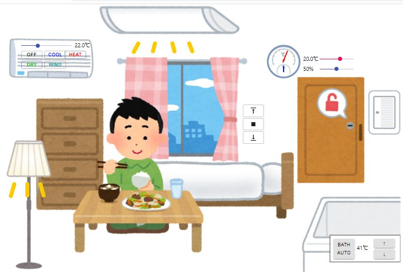

# echonet-lite-kaden-emulator

仮想的な家電を制御できるECHONET Liteのエミュレータです。

## Description

ブラウザ上で操作することで仮想的な家電を操作でき、その状態をUDPのECHONET Lite規格で公開します。
また、UDP経由のECHONET Liteプロトコルで制御することもできます。




対応している機器は以下です。
* シーリングライト (ECHONET Liteクラス:0x0291 単機能照明)
* 温度計 (ECHONET Liteクラス:0x0011 温度センサ)
* 湿度計 (ECHONET Liteクラス:0x0012 湿度センサ)
* モーションセンサー (ECHONET Liteクラス:0x0007 人体検知センサ)
* フロアライト (ECHONET Lite クラス:0x0290 一般照明)
* 電動シャッター (ECHONET Liteクラス:0x0263 電動雨戸・シャッター)
* 電気錠 (ECHONET Liteクラス:0x026f 電気錠)
* 電器風呂給湯機 (ECHONET Liteクラス:0x026b 電気温水器)
* エアコン (ECHONET Liteクラス:0x0130 家庭用エアコン)

ECHONET Liteの仕様としては、[APPENDIX ECHONET機器オブジェクト詳細規定Release P](https://echonet.jp/spec_object_rp/) に従うようにしています。
ただ、必須のプロパティは実装しましたが、基本的な機能しか対応していません。

ECHONET Liteのエミュレータと言えば、 [MoekadenRoom](https://github.com/SonyCSL/MoekadenRoom) が有名ですが、
こちらは、やや仕様が古いのと、必要な家電がそろっていなかったので、新たに作っています。


## 使用方法

実行には以下が必要です。
* Node.js (ver.14以降推奨)

以下の手順で動作させることができます。

1. リポジトリをCloseします

2. 依存モジュールをインストールします。(初回のみ)
```
npm install
```
3. フロントエンドをビルドします。(初回のみ)
```
npm run build
```

4. サーバーを開始します。
```
npm start
```

5. ブラウザで、 http://localhost:3000/ にアクセスします。

6. 終了にするには、Ctrl+Cを入力してください。

## 開発方法

通常の `npm start` での実行の他にフロントエンドだけを開発モードで起動することができます。
Create-React-Appを使用しているため、ソースコードの変更がすぐに反映されます。

バックエンドを `npm start` で起動した後、以下のコマンドで開発モードのフロントエンドを起動してください。

```
npm run start-react
```


## サードパーティの使用

* アプリケーション内の画像は、 [いらすとや](https://www.irasutoya.com/) の素材を使用しています。

## ライセンス

[MIT](LICENSE)

## Author

[banban525](https://github.com/banban525)

